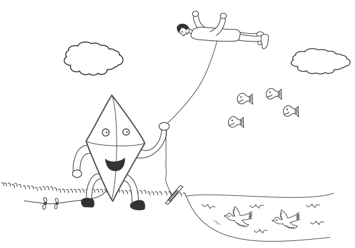

# Desegnaĉo

Ĉi tiu deponejo celas esti projekto por krei liberan version de
populara ludo pri desegnado kiu disponeblos per la krea komunaĵo.

En la ludo estas kartoj kun simplaj amuzaj desegnaĵoj. Unu el la
ludantoj laŭvice estas parolisto kiu ricevas unu el la kartoj. Ri tiam
devas voĉe priskribi la desegnaĵon al la aliaj ludantoj sen ke ili
vidus ĝin. Dume ili provas redesegni la desegnaĵon laŭ la priskribo.

Post mallonga limigita tempo, la ludantoj devas ĉesi desegni. Sur la
alia flanko de la karto estas listo de trajtoj de la desegnaĵo kiun la
parolisto nun rajtas vidi. Ri laŭtlegas ilin kaj ĉiu ludanto kiu
sukcese inkluzivis tiun trajton en sia desegnaĵo ricevas poenton. La
parolisto ankaŭ ricevas poenton se almenaŭ unu homo sukcesis desegni
la trajton, tiel ke la ludo instigas rin bone priskribi.

Ekzemplo de bildo povus esti:

Kaj ekzemplaj trajtoj povus esti:

1. Estas ekzakte 4 fiŝoj en la sceno.
2. La manoj de la homo estas pli proksimaj al la supro de la desegnaĵo ol ĉiu nubo.
3. La kajto havas nek nazon, nek dentojn, nek orelojn.
4. La ŝnuro de la kajto havas ekzakte 2 nodojn.
5. La birdoj direktas maldekstren.
6. Videblas herbo en la sceno.
7. Ĉiuj birdoj aperas sub la supro de la akvo.
8. La ŝnuro kiun la kajto tenas estas ligita al bastoneto.
9. Estas almenaŭ unu ŝuo en la sceno kaj neniu ŝuo havas laĉojn.
10. La kapo de la homo estas maldekstre de liaj piedoj.

Por komenci, la celo de la projekto estas simple kolekti desegnaĵojn
kaj trajtojn por la kartoj. Se vi havas ideon por karto, ne hezitu
sendi ĝin al ni. Post kiam ni havos sufiĉe da kartoj, ni povos fari
kartaron el ili aŭ retejon por ebligi ludi ĝin rete.
